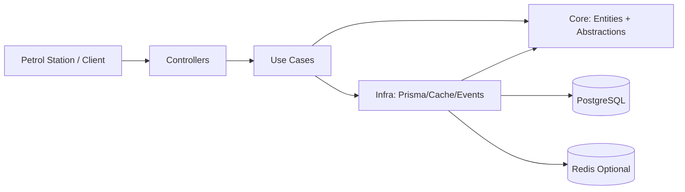

# MyFuel Transaction Processor

A NestJS webhook service to process fuel transactions.

## What This Project Solves
- Validate organization balance.
- Validate card daily/monthly limits.
- Approve or reject transaction.
- Save full history for audit.

## Tech Stack
- Node.js 22
- NestJS + TypeScript
- PostgreSQL + Prisma
- Redis (optional cache)
- Jest
- Swagger
- GitHub Actions

## Clean Architecture (Simple View)



Layer mapping:
- `src/core`: entities and contracts (`IDataServices`, `ICacheService`, `ITransactionEventPublisher`)
- `src/use-cases`: business flow (`TransactionUseCases`)
- `src/controllers`: HTTP adapter (`WebhookController`)
- `src/frameworks`: Prisma repositories, cache service, event publisher/handler
- `src/services`: dependency wiring modules

## Main Business Rules
- Idempotency by unique `requestId`.
- Reject when card not found/inactive.
- Reject when organization not found.
- Reject when insufficient balance.
- Reject when daily/monthly limit exceeded.
- Approved flow updates:
  - `Transaction`
  - organization balance
  - daily/monthly usage
  - `BalanceLedger`
- Rejected flow logs audit in `WebhookRejectionLog`.
- Concurrency safety uses DB transaction + `FOR UPDATE` lock.

## API
Base URL: `http://localhost:3000/api/v1`

Swagger: `http://localhost:3000/swagger`

### `POST /webhooks/transactions`
Header:
- `x-api-key: <WEBHOOK_API_KEY>`

Request:
```json
{
  "requestId": "station-abc-20260211-0001",
  "cardNumber": "6037991234561001",
  "amount": 350000,
  "transactionAt": "2026-02-11T09:00:00Z",
  "stationId": "SPBU-12345"
}
```

Response style:
- `code = SUCCESS` for approved
- `code = REJECTED` for business rejection (HTTP 200)
- 4xx/5xx for validation/auth/system errors

## Environment
See `.env.example`.

Important keys:
- `DATABASE_URL`
- `WEBHOOK_API_KEY`
- `REDIS_URL` (optional)
- `REDIS_KEY_PREFIX` (optional)
- `REDIS_DB` (optional)

## Run
```bash
nvm use 22
npm install
npm run prisma:generate
npm run start:dev
```

First setup:
```bash
npm run db:bootstrap
```

## Test and Build
```bash
npm run lint
npm test -- --runInBand
npm run build
```

E2E:
```bash
ENABLE_E2E_SOCKET=true npm run test:e2e -- --runInBand
```

## Assessment Deliverables
- System design: [docs/system-design.md](./docs/system-design.md)
- CI workflow: [.github/workflows/ci.yml](./.github/workflows/ci.yml)
