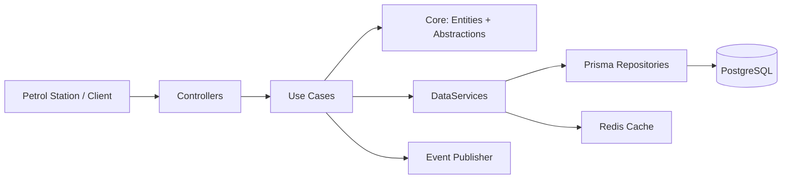
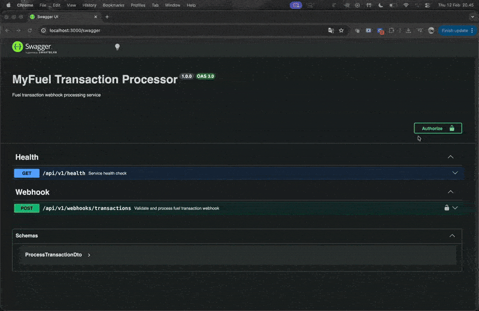

# MyFuel Transaction Processor

A NestJS webhook service to process fuel transactions.

## Assessment Deliverables
- System design: [docs/system-design.md](./docs/system-design.md)
- CI workflow: [.github/workflows/ci.yml](./.github/workflows/ci.yml)

## System Design (Highlight)
Main design document: [docs/system-design.md](./docs/system-design.md)

Quick navigation:
- Flow Diagram: [1) Flow Diagram](./docs/system-design.md#1-flow-diagram)
- ERD: [2) ERD](./docs/system-design.md#2-erd)
- High-Level Architecture: [3) High-Level Architecture](./docs/system-design.md#3-high-level-architecture)

Key design focus:
- Handle many requests with DB transaction and row lock (`FOR UPDATE`)
- Keep history data (`Transaction`, `BalanceLedger`, `WebhookRejectionLog`)
- Easy to add new rules later (weekly, vehicle, organization total)

## What This Project Solves
- Check organization balance.
- Check card daily and monthly limits.
- Approve or reject each transaction.
- Save history for audit.

## Tech Stack
- Node.js 22
- NestJS + TypeScript
- PostgreSQL + Prisma
- Redis (optional cache)
- Jest
- Swagger
- GitHub Actions

## Clean Architecture (Simple View)



Layer mapping:
- `src/core`: entities and contracts (`IDataServices`, `ITransactionEventPublisher`)
- `src/use-cases`: business logic (`TransactionUseCases`)
- `src/controllers`: HTTP layer (`WebhookController`)
- `src/frameworks`: Prisma, Redis, and event implementation
- `src/services`: module wiring for dependency injection

Data-services composition:
- `IDataServices.prisma`: all DB repositories
- `IDataServices.redis`: Redis cache
- `src/services/data-services/data-services.service.ts`: combine Prisma and Redis for use-cases

## Main Business Rules
- Idempotency by unique `requestId`:
  - same `requestId` + same payload -> validate card first, then return previous result
  - same `requestId` + different payload -> reject (`DUPLICATE_REQUEST`)
- Validation order: card lookup/active check first, then organization check.
- Reject when card is not found or inactive.
- Reject when organization not found.
- Reject when insufficient balance.
- Reject when daily or monthly limit is exceeded.
- Approved flow updates:
  - `Transaction`
  - organization balance
  - daily/monthly usage
  - `BalanceLedger`
- Rejected flow writes audit data to `WebhookRejectionLog`.
- Safe concurrent update uses DB transaction and `FOR UPDATE` lock.

## Trade-offs
- Business rejection uses HTTP 200 with `code=REJECTED`.
  This keeps webhook retry behavior simple, but it reduces HTTP semantic clarity.
- Idempotency check uses `requestId` plus key fields (station, amount, transaction time).
  This is lightweight and practical, but not as strict as full payload hashing.
- Redis is a performance layer, not a source of truth.
  If Redis is unavailable, service falls back to in-memory cache and PostgreSQL reads.
- Event publishing is non-blocking for the main transaction path.
  This protects transaction reliability, but event delivery is best-effort.
- Test strategy is mock-first unit testing for fast feedback.
  This improves development speed, but end-to-end runtime coverage is limited.

## API
Base URL: `http://localhost:3000/api/v1`

Swagger: `http://localhost:3000/swagger`

### `POST /webhooks/transactions`
Header:
- `x-api-key: <WEBHOOK_API_KEY>`
- Optional (if signature is enabled):
  - `x-timestamp: <unix-seconds>`
  - `x-signature: <sha256_hmac_of_timestamp_dot_body>`

Request:
```json
{
  "requestId": "station-abc-20260211-0001",
  "cardNumber": "6037991234561001",
  "amount": 350000,
  "transactionAt": "2026-02-11T09:00:00Z",
  "stationId": "SPBU-12345"
}
```

Response style:
- `code = SUCCESS` for approved
- `code = REJECTED` for business rejection (HTTP 200)
- 4xx/5xx for validation, auth, or server errors

## API Documentation


## Setup and Run
1. Use Node.js 22
```bash
nvm use 22
```

2. Install dependencies
```bash
npm install
```

3. Create environment file
```bash
cp .env.example .env
```

Important env keys:
- `DATABASE_URL`
- `WEBHOOK_API_KEY`
- `WEBHOOK_SIGNATURE_SECRET` (optional)
- `WEBHOOK_TIMESTAMP_TOLERANCE_SECONDS` (optional)
- `REDIS_URL` (optional)
- `REDIS_KEY_PREFIX` (optional)
- `REDIS_DB` (optional)

4. Prepare database
```bash
npm run db:bootstrap
```

5. Run the app
```bash
npm run start:dev
```

## Test and Build
```bash
npm run lint
npm test -- --runInBand
npm run test:e2e -- --runInBand
npm run build
```
