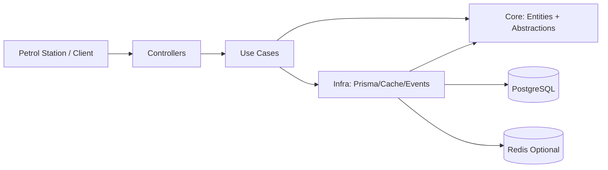

# MyFuel Transaction Processor

A NestJS webhook service for fuel transactions.

## What This Project Solves
- Check organization balance.
- Check card daily and monthly limits.
- Approve or reject each transaction.
- Save history for audit.

## Tech Stack
- Node.js 22
- NestJS + TypeScript
- PostgreSQL + Prisma
- Redis (optional cache)
- Jest
- Swagger
- GitHub Actions

## Clean Architecture (Simple View)



Layer mapping:
- `src/core`: entities and contracts (`IDataServices`, `ITransactionEventPublisher`)
- `src/use-cases`: business logic flow (`TransactionUseCases`)
- `src/controllers`: HTTP adapter (`WebhookController`)
- `src/frameworks`: technical implementation (`data-services/prisma`, `data-services/redis`, events)
- `src/services`: module wiring for dependency injection

Data-services composition:
- `IDataServices.prisma`: all database repositories
- `IDataServices.redis`: Redis cache access
- `src/services/data-services/data-services.service.ts`: combine Prisma + Redis in one service for use-cases

## Main Business Rules
- Idempotency by unique `requestId`.
- Reject when card is not found or inactive.
- Reject when organization not found.
- Reject when insufficient balance.
- Reject when daily or monthly limit is exceeded.
- Approved flow updates:
  - `Transaction`
  - organization balance
  - daily/monthly usage
  - `BalanceLedger`
- Rejected flow writes audit data to `WebhookRejectionLog`.
- Concurrency safety uses DB transaction and `FOR UPDATE` lock.

## API
Base URL: `http://localhost:3000/api/v1`

Swagger: `http://localhost:3000/swagger`

### `POST /webhooks/transactions`
Header:
- `x-api-key: <WEBHOOK_API_KEY>`
- Optional (if signature is enabled):
  - `x-timestamp: <unix-seconds>`
  - `x-signature: <sha256_hmac_of_timestamp_dot_body>`

Request:
```json
{
  "requestId": "station-abc-20260211-0001",
  "cardNumber": "6037991234561001",
  "amount": 350000,
  "transactionAt": "2026-02-11T09:00:00Z",
  "stationId": "SPBU-12345"
}
```

Response style:
- `code = SUCCESS` for approved
- `code = REJECTED` for business rejection (HTTP 200)
- 4xx/5xx for validation, auth, or system errors

## Environment
See `.env.example`.

Important keys:
- `DATABASE_URL`
- `WEBHOOK_API_KEY`
- `WEBHOOK_SIGNATURE_SECRET` (optional)
- `WEBHOOK_TIMESTAMP_TOLERANCE_SECONDS` (optional)
- `REDIS_URL` (optional)
- `REDIS_KEY_PREFIX` (optional)
- `REDIS_DB` (optional)

## Run
```bash
nvm use 22
npm install
npm run prisma:generate
npm run start:dev
```

First setup:
```bash
npm run db:bootstrap
```

## Test and Build
```bash
npm run lint
npm test -- --runInBand
npm run test:e2e -- --runInBand
npm run build
```

## Assessment Deliverables
- System design: [docs/system-design.md](./docs/system-design.md)
- CI workflow: [.github/workflows/ci.yml](./.github/workflows/ci.yml)
