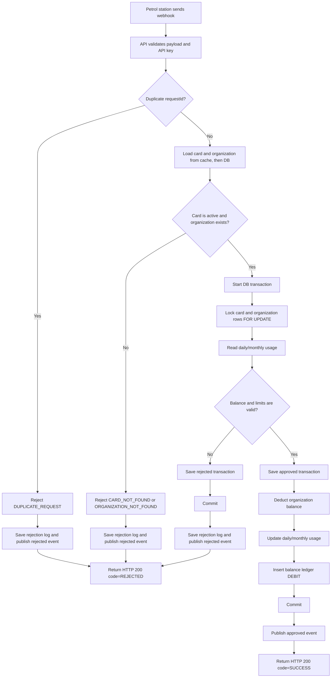
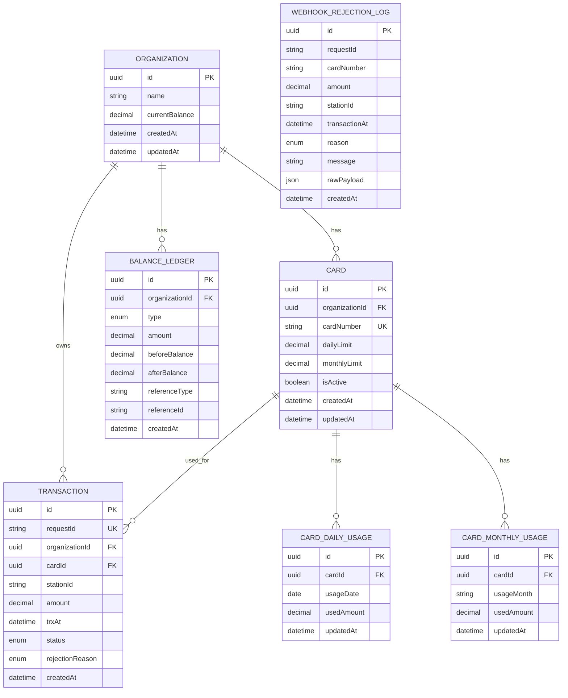
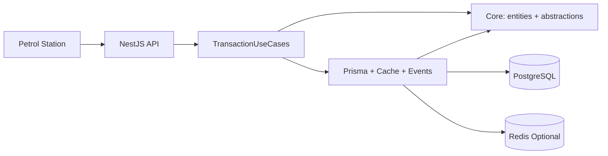

# System Design

This document covers Part 1 deliverables:
- Flow Diagram
- ERD
- High-Level Architecture

## 1) Flow Diagram

## 2) ERD

ERD note:
- Optional fields in code: `Transaction.rejectionReason`, `WebhookRejectionLog.cardNumber`, `WebhookRejectionLog.amount`, `WebhookRejectionLog.stationId`, `WebhookRejectionLog.transactionAt`, `WebhookRejectionLog.rawPayload`.

## 3) High-Level Architecture

## Design Notes
- Business rejection returns HTTP 200 with `code=REJECTED`.
- Idempotency uses unique `requestId`.
- Concurrency safety uses DB transaction and row lock.
- History is saved in `Transaction`, `BalanceLedger`, and `WebhookRejectionLog`.
- Easy to extend for weekly limit, vehicle limit, and organization aggregate limit.
