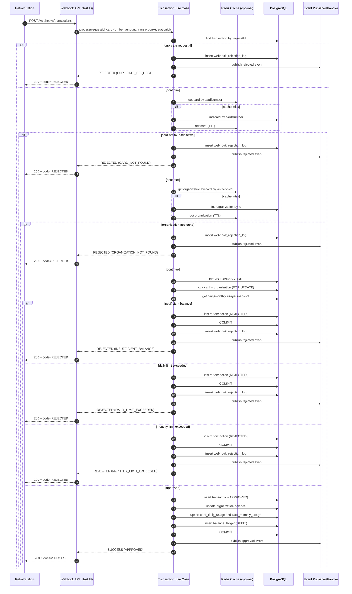
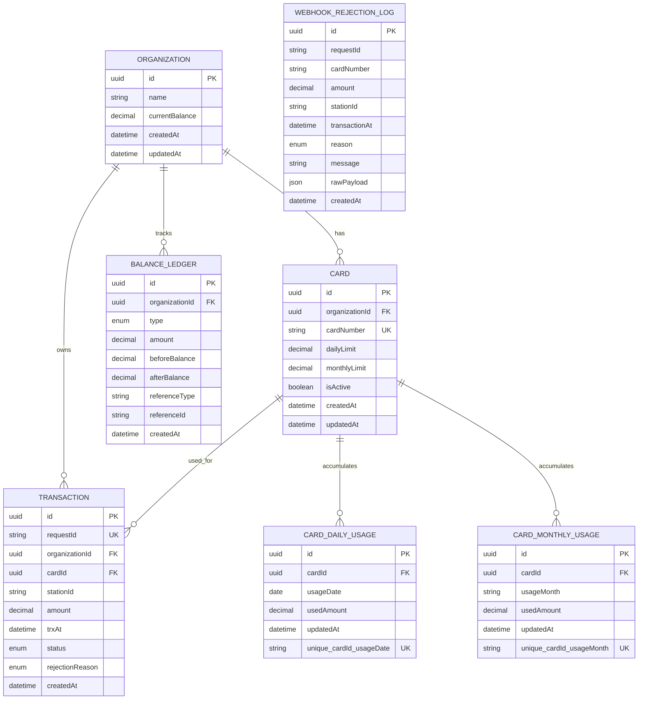
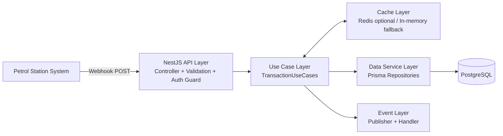

# System Design

This document covers Part 1 deliverables:
- Flow Diagram
- ERD
- High-Level System Architecture

## 1) Flow Diagram

## 2) ERD

## 3) High-Level Architecture

## Scalability and Extensibility Notes

- Concurrency-safe write path:
  - transaction boundary in database.
  - row locks (`FOR UPDATE`) on card and organization before final validation and write.
- Idempotency:
  - unique `requestId` on `Transaction`.
  - duplicate handling in application + DB unique constraint fallback.
- Historical tracking:
  - `Transaction` stores all approved/rejected outcomes.
  - `BalanceLedger` stores balance movement history.
  - `WebhookRejectionLog` stores rejected payload context for audit/debug.
- Usage reset logic:
  - daily and monthly usage are naturally partitioned by `usageDate` and `usageMonth`.
- Future rule extensions:
  - Add `CardWeeklyUsage` for weekly limits.
  - Add `Vehicle` and relation to `Card` for vehicle-based limit.
  - Add organization aggregate limit table and validator strategy.
- Performance:
  - optional Redis cache for card/organization read path.
  - indexes on frequently filtered columns (`requestId`, `cardId`, `organizationId`, `status`, `trxAt`).

## Assumptions

- One webhook request represents one fuel purchase.
- API returns HTTP 200 for business reject (`code=REJECTED`) to avoid sender retry storms.
- Validation or authentication failures return proper 4xx.
- Decimal money precision uses database decimal and use-case minor-unit conversion for comparisons.
